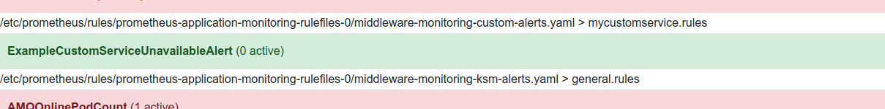
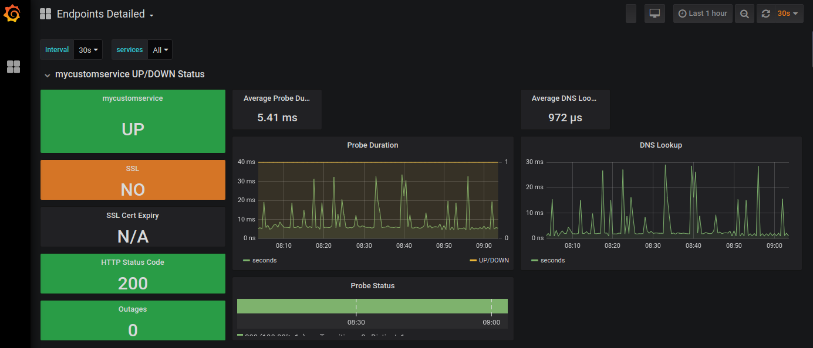

# Monitoring customization

It's possible to add your own monitoring and alerting to the cluster after it's installed.

## Adding your own monitoring rule

### HTTP(s) service monitoring

The easiest way to add your rule is by using *BlackboxTarget*. The Blackbox Target CR accepts the following properties in the spec:

* *blackboxTargets*: A list of targets for the blackbox exporter to probe.

The `blackboxTargets` should be provided as an array in the form of:

```yaml
  blackboxTargets:
    - service: example
      url: https://example.com
      module: http_extern_2xx
```

where `service` will be added as a label to the metric, `url` is the URL of the route to probe and `module` can be one of:

* *http_2xx*: Probe http or https targets via GET using the cluster certificates
* *http_post_2xx*: Probe http or https targets via POST using the cluster certificates
* *http_extern_2xx*: Probe http or https targets via GET relying on a valid external certificate

Follow up on the example here - https://github.com/integr8ly/application-monitoring-operator/blob/master/deploy/examples/BlackboxTarget.yaml

The process of adding your own alert is this:

1) Create yaml file with the `BlackboxTarget` CR (by modifying `BlackboxTarget.yaml` example above):

```yaml
apiVersion: applicationmonitoring.integreatly.org/v1alpha1
kind: BlackboxTarget
metadata:
  name: custom-mycustomservice-blackboxtarget
spec:
  blackboxTargets:
    - service: mycustomservice
      url: http://mycustomservice-my-nodejsproject.apps.vsazel-a4c3.open.redhat.com/  #replace with your service
      module: http_extern_2xx
```

and import CR to your cluster:

```bash
$ oc create -f BlackboxTarget.yaml -n middleware-monitoring
blackboxtarget.applicationmonitoring.integreatly.org/example-blackboxtarget created
```

2) Create yaml file with the alerting CR `PrometheusRule`. 

```yaml
apiVersion: monitoring.coreos.com/v1
kind: PrometheusRule
metadata: 
  labels:
    monitoring-key: custom-monitoring
    prometheus: application-monitoring
    role: alert-rules
  name: custom-alerts
spec:   
  groups: 
    - name: mycustomservice.rules
      rules: 
      - alert: ExampleCustomServiceUnavailableAlert
        annotations:
          message: >-
            Custom Service unavailable: If this console is
            unavailable, the clients won't be able to do something.
        expr: >
          probe_success{job="blackbox",service="mycustomservice"} < 1 or
            absent(probe_success{job="blackbox",service="mycustomservice"})
        for: 5m
        labels:
          severity: critical
```
and import it same as in previous case

```bash
$ oc create -f CustomMonitoringRule.yaml -n middleware-monitoring
prometheusrule.monitoring.coreos.com/custom-alerts created
```

3) In *Prometheus* UI you should see the new alert. Check if it's working by killing the monitored service (decreasing pod count to 0).

.


### Kubernetes monitoring

Other way to monitor your custom services is to use Kubernetes monitoring itself. Integr8ly itself contains *kube-state-metrics* statistics.

Check out the documentation on that there - https://github.com/kubernetes/kube-state-metrics/tree/master/docs

1) Create custom `PrometheusRule` CR 

_Note: (Example Node.js project has `mycustomservice` container and is running in namespace `my-nodejsproject`) _

```yaml
apiVersion: monitoring.coreos.com/v1
kind: PrometheusRule
metadata: 
  labels:
    monitoring-key: middleware
    prometheus: application-monitoring
    role: alert-rules
  name: custom-kubernetes-alerts
spec:   
  groups: 
    - name: mycustomservice.rules
      rules: 
      - alert: ExampleCustomServicePodsAlert
        annotations:
          message: >-
            Custom Service pod: No pods ready.
        expr: >
          (1-absent(kube_pod_labels{namespace="my-nodejsproject",label_deploymentconfig="mycustomservice"} * 
          on(pod,pod) kube_pod_status_ready{namespace="my-nodejsproject", condition="true"}))
        for: 5m
        labels:
          severity: critical
```
2) Save it into file and import

```bash
$ oc create -f CustomMonitoringKubernetesRules.yaml -n middleware-monitoring
prometheusrule.monitoring.coreos.com/custom-kubernetes-alerts created
```

3) Check it in *Prometheus* UI

### CPU and memory monitoring
Another useful metric is usually to check CPU and memory utilization and how it goes with set up pod limits on Kubernetes cluster.

_Note: Some service is running in `my-customservice` container_

1) Create custom `PrometheusRule` CR 

```yaml
apiVersion: monitoring.coreos.com/v1
kind: PrometheusRule
metadata: 
  labels:
    monitoring-key: middleware
    prometheus: application-monitoring
    role: alert-rules
  name: custom-limits-alerts
spec:   
  groups: 
    - name: mycustomservice.rules
      rules: 
      - alert: MyServicePodCPUHigh
        expr: "(sum(label_replace(sum by(namespace, pod_name, container_name) (rate(container_cpu_usage_seconds_total{namespace='my-customservice'}[5m])), 'container', '$1', 'container_name', '(.*)')) by (container) / sum(kube_pod_container_resource_limits_cpu_cores{namespace='my-customservice'}) by (container) * 100) > 90"
        for: 5m
        labels:
          severity: warning
        annotations:
          description: "The MyService pod has been at 90% CPU usage for more than 5 minutes."
          summary: "The MyService is reporting high cpu usage for more that 5 minutes."        
      - alert: MyServicePodMemoryHigh
        expr: "(sum by(container) (label_replace(container_memory_usage_bytes{container_name!='',namespace='my-customservice'}, 'container', '$1', 'container_name', '(.*)')) / sum by(container) (kube_pod_container_resource_limits_memory_bytes{namespace='my-customservice'}) * 100) > 90"
        for: 5m
        labels:
          severity: warning
        annotations:
          description: "The MyService pod has been at 90% memory usage for more than 5 minutes."
          summary: "The MyService is reporting high memory usage for more that 5 minutes."
```

2) Save it into file and import

```bash
$ oc create -f CustomMonitoringLimitsRules.yaml -n middleware-monitoring
prometheusrule.monitoring.coreos.com/custom-limits-alerts created
```

3) Check it in *Prometheus* UI


## Items created in the built-in Grafana dashboards

If you add `BlackboxTarget` it makes service automatically visible on the *Endpoints Summary*, *Endpoints Report* and *Endpoints Detailed* dashboards.




